<p align="center"> 
    
</p>


<h1 align="center"> 🤗 Hugging Face Hub Garden Project 🌿</h1>

<div align="center">
<a href="https://pseudo-lab.com"></a>
<a href="https://discord.gg/EPurkHVtp2"></a>
<a href="https://github.com/Pseudo-Lab/Hugging-Face-Hub-Garden/stargazers"></a>
<a href="https://github.com/Pseudo-Lab/Hugging-Face-Hub-Garden/network/members"></a>
<a href="https://github.com/Pseudo-Lab/Hugging-Face-Hub-Garden/pulls"></a>
<a href="https://github.com/Pseudo-Lab/Hugging-Face-Hub-Garden/issues"></a>
<a href="https://github.com/Pseudo-Lab/Hugging-Face-Hub-Garden/graphs/contributors"></a>
<a href="https://hits.seeyoufarm.com"></a>
</div>
<br>

<!-- sheilds: https://shields.io/ -->
<!-- hits badge: https://hits.seeyoufarm.com/ -->

> Welcome to Hugging Face Hub Garden repository! We aim to cultivate a vibrant AI development community, offering tools and frameworks for dataset creation, model fine-tuning, and knowledge sharing. Join us in advancing the field of Korean language AI through open collaboration and innovation!

## 🌟 Project Vision
<h3 align="center"> "An AI Hub Garden Filled with Data and Models for Everyone" </h3>

<p align="center"> 
    
</p>
        
The **Hugging Face Hub Garden** project is a journey that goes beyond simply building datasets - it's about experiencing the process of **creating your own resources and sharing them with the world**.

In this project, we aim to **design our own datasets, find optimal models for fine-tuning, and upload them to the Hugging Face Hub**. Through **collaboratively thinking about, experimenting with, and improving** dataset construction and model optimization - tasks that can be challenging to tackle alone - we can gain deeper insights.

From data collection to refinement, applying various fine-tuning techniques, performance evaluation, and dataset improvement—this will be an opportunity to **experience the entire process firsthand and grow from learners into creators**.

Shall we cultivate our hub garden together? 🌿✨

---

## Hugging Face KREW
<div align="center">

</div>

**Hugging Face KREW** is a **research team at Pseudo Lab**, a community that conducts various studies and contribution activities related to Hugging Face. 🤗  
In **Season 10**, we are working on the following projects:  
- [**Hugging Face Beyond First PR**](https://github.com/Pseudo-Lab/Hugging-Face-Beyond-First-PR?tab=readme-ov-file)  
- [**Hugging Face Hub Garden**](https://github.com/Pseudo-Lab/Hugging-Face-Hub-Garden)
- [**Hugging Face Cookbook Chefs**](https://github.com/Pseudo-Lab/Hugging-Face-Cookbook-Class-Wars)

Hugging Face KREW is a non-profit community with a direct communication line to Hugging Face headquarters. We have received various support from Hugging Face to collaborate, and based on that experience, we aim to help more researchers and developers utilize AI technology.

> **We are currently supporting dataset creation and fine-tuning with computing resources using credits provided by Hugging Face, and we plan to provide additional GPU support more efficiently.**

To learn more about Hugging Face KREW, check [here](https://calm-book-46f.notion.site/Hugging-Face-KREW-146f51a7c11780c3a6bfc1b72e9fd65e?pvs=4)! 🚀✨

---

## 🧑 Our Team

| Role          | Name |  Tech Stack Badges                                                                 | Main Interests                          |
|---------------|------|-----------------------------------------------------------------------|----------------------------------------|
| **Project Manager** | Harheem Kim &nbsp;|   | Generative AI, Open Source Contribution    |
| **Member** | Jaeyoon Jung &nbsp;|   |  VLA, CPC, Open Source Contribution |
| **Member** | Yongsang Yoo &nbsp;|    | LLM, Dialogue Systems, Language Model Evaluation |
| **Member** | Jungjin Lee &nbsp;|   | Generative AI, Reasoning, Open Source Contribution |
| **Member** | Youngjun Cho &nbsp;|   | Open Source Contribution, Generative AI |
| **Member** | Sohyun Shim &nbsp;|    | Data Analysis, Inference, Open Source Contribution |
| **Member** | Suil Lee &nbsp;|   | LLM Fine-tuning, MLOps  |
| **Member** | Sungwoo Choi &nbsp;|    | Generative AI, Open Source Contribution  |
---

## 🚀 Project Roadmap

```mermaid
gantt
    title 2025 AI Project Journey
    section Core Milestones
    Project Planning       :a1, 2025-03-06, 13d
    Data Building & Refinement   :a2, after a1, 20d
    Model Training & Evaluation    :a3, after a2, 27d
    Model Improvement & Evaluation    :a4, after a3, 30d
    section Additional Activities
    SudoCon Presentation Prep     :2025-4-27, 20d
    SudoCon 📢          :2025-5-17, 1d
```


---

## 🛠️ Our Development Culture  

```python
class CollaborationFramework:
    def __init__(self):
        self.tools = {
            'communication': ['Discord', 'Notion'],
            'documentation': 'Notion',
            'version_control': 'GitHub Projects'
        }
    
    def workflow(self):
        return """Weekly Process:
        1️⃣ Weekly Meeting (Every Thursday, 21:00 ~ 22:00)
            - Share progress and feedback
            - Discuss this week's learning and experiment results
            - Seminar and next week's activity guide
        
        2️⃣ Share progress in blog article format
            - Document experiments and data building experiences
            - Document data and models to be shared on Hugging Face Hub
            - Record key learnings and problem-solving processes
        
        3️⃣ Weekly Code Review (GitHub PR)
            - PR for dataset construction and model development code
            - Code review among team members before merging
            - Discussion of best practices and improvements
        """
```
---

## 📈 Achievement Metrics
**2025 Key KPIs**  
| Metric                     | Target | Current Progress |
|--------------------------|--------|-------------|
| 🤗 Datasets Published                 | 6  |    0%      |
| 🤗 Fine-tuned Models Deployed              | 6    |   0%      | 
| Technical Blog Posts       | 24   |   0%     |
| Technical Seminars       | 12   |    0%    |


---

## 💻 Weekly Activities (Activity History)

| Date | Mission | Seminar Topic | Presenter |  
| :--------: | :------------------------------------------: | :--------------------------------------------: | :----: |  
| 2025/03/06 | **Orientation** |  | Harheem Kim |  
| 2025/03/13 | Project Topic Selection | How to Write a Project Proposal | Harheem Kim |  
| 2025/03/20 | Data Collection | Introduction to Data Collection and Generation Techniques | Jungjin Lee |  
| 2025/03/27 | **✨ Magical Week ✨** |  |  |  
| 2025/04/03 | Dataset Quality Validation and Enhancement | High-Quality Dataset Building Methodology | Sohyun Shim |  
| 2025/04/10 | Writing Hugging Face Dataset Cards | Hugging Face Dataset Card Guide<br>Exploring the Hugging Face Model Hub | Sungwoo Choi |  
| 2025/04/17 | Model Exploration Phase 1 | Model Performance Evaluation Methodology | Suil Lee |  
| 2025/04/24 | **✨ Magical Week ✨** |  |  |  
| 2025/05/01 | Model Fine-tuning and Optimization | Efficient Model Fine-tuning Strategies | Yongsang Yoo |  
| 2025/05/08 | Project Mid-term Review and Discussion<br>(Performance Analysis and Feedback)|  |  |  
| 2025/05/17 | **SudoCon Presentation** |  |  |  
| 2025/05/22 | Final Model and Dataset Upload | Hugging Face Model Card Writing Guide | Youngjun Cho |  
| 2025/05/29 | Implementing Hugging Face Space Demo Applications | Hugging Face Spaces Guide | Jaeyoon Jung |  
| 2025/06/05 | Guidebook and Blog Writing | MCP with Gradio | Harheem Kim |  
| 2025/06/12 |  | Project Wrap-up and Final Retrospective | All |

---

Seminar topics are just guidelines, a starting point to make our journey more meaningful. 

We grow together by exploring each week's activities and sharing insights on **topics selected by team members** that can be applied immediately in practice. 🚀

## 🌿 Our Planted Contributions
- Links (Coming Soon)

---

## 💡 Learning Resources
### Essential Materials
- [Hugging Face Hub](https://huggingface.co/docs/hub/index)
- [Hugging Face AutoTrain](https://huggingface.co/docs/autotrain/index)
- [Hugging Face Evaluate](https://huggingface.co/docs/evaluate/index)
- [Hugging Face NLP Course - Supervised Fine-Tuning](https://huggingface.co/learn/nlp-course/en/chapter11/1)

### Reference Materials
Hugging Face Official Resources
- [Hugging Face Blog](https://huggingface.co/blog): Sharing latest research and tutorials
- [Hugging Face NLP Course](https://huggingface.co/learn/nlp-course/chapter1/1): Free course with code on Transformers, Datasets, Tokenizers
- [Hugging Face Documentation](https://huggingface.co/docs): Explanation of Datasets, Model Hub, Trainer API

Natural Language Processing and Machine Learning Basics
- [Introduction to Natural Language Processing with Deep Learning](https://wikidocs.net/book/2155): Introductory textbook for deep learning NLP
- [Fast.ai NLP Course](https://course.fast.ai/): Practice-based NLP introductory course
- [The Illustrated Transformer](https://nlpinkorean.github.io/illustrated-transformer/): Blog article intuitively explaining the Transformer architecture

---

## 🌱 How to Engage

### **✨ We're Looking For People Like This**

<p align="center">
    
</p>

The Hugging Face Hub Garden project values the **process of growing, learning, and sharing together**. 

We're looking for people who can **enjoy collaboration and learning in the process**, not just focusing on results.

🔎 **We especially welcome those with these experiences!**  
✔ **You're passionate about data and AI!**  
- You have experience collecting or refining data.  
- You have experience using or training natural language processing (NLP) models.  
- You have planned or carried out data-based projects.  

✔ **You enjoy creating and improving models!**  
- You have experience fine-tuning models or improving their performance.  
- You enjoy experimenting with models using new datasets.  
- You have experience with or want to learn Hugging Face libraries.  

✔ **You enjoy a culture of growing together!**  
- You're interested in open source contributions or community activities.  
- You enjoy organizing and sharing your knowledge (through blogs, seminars, code reviews, etc.).
- You find joy in exchanging ideas and collaborating with other team members.

✔ **You enjoy challenges and experiments!**
- You like learning and experimenting with new technologies.
- You're willing to actively take on new challenges and grow, even with unfamiliar tasks.
- You find it fun to learn from failures and work together to find solutions.

**It's okay if you don't meet all these conditions!**
- We welcome those who are new to Hugging Face!
- You can join us even if this is your first project in AI and data fields.
- Anyone who wants to experience with a team what would be difficult to do alone is welcome to participate!

**What you can experience in this project**
✅ Creating your own datasets and training models
✅ Experimenting with and sharing the latest AI models
✅ Contributing to open source and collaborating in a community
✅ Building practical skills and strengthening your portfolio through real project experience

Let's meet at the Hugging Face Hub Garden ✨

---

## Acknowledgement 🙏

Hugging Face Hub Garden Project is developed as part of Pseudo-Lab's Open Research Initiative. Special thanks to our contributors and the open source community for their valuable insights and contributions.

## About Pseudo Lab 👋🏼</h2>

[Pseudo-Lab](https://pseudo-lab.com/) is a non-profit organization focused on advancing machine learning and AI technologies. Our core values of Sharing, Motivation, and Collaborative Joy drive us to create impactful open-source projects. With over 5k+ researchers, we are committed to advancing machine learning and AI technologies.

<h2>Contributors 😃</h2>
<a href="https://github.com/Pseudo-Lab/Hugging-Face-Hub-Garden/graphs/contributors">
  
</a>
<br><br>

<h2>License 🗞</h2>

This project is licensed under the [MIT License](https://opensource.org/licenses/MIT).
