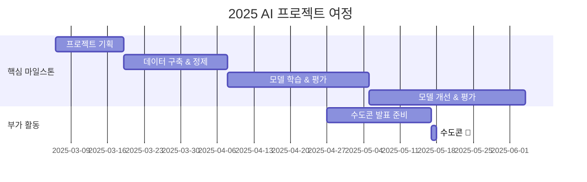

<p align="center"> 
    
</p>
<h1 align="center"> 🤗 Hugging Face Hub Garden Project 🌿</h1>


<div align="center">
<a href="https://pseudo-lab.com"></a>
<a href="https://discord.gg/EPurkHVtp2"></a>
<a href="https://github.com/Pseudo-Lab/Hugging-Face-Hub-Garden/stargazers"></a>
<a href="https://github.com/Pseudo-Lab/Hugging-Face-Hub-Garden/network/members"></a>
<a href="https://github.com/Pseudo-Lab/Hugging-Face-Hub-Garden/pulls"></a>
<a href="https://github.com/Pseudo-Lab/Hugging-Face-Hub-Garden/issues"></a>
<a href="https://github.com/Pseudo-Lab/Hugging-Face-Hub-Garden/graphs/contributors"></a>
<a href="https://hits.seeyoufarm.com"></a>
</div>
<br>

<!-- sheilds: https://shields.io/ -->
<!-- hits badge: https://hits.seeyoufarm.com/ -->

> Welcome to Hugging Face Hub Garden repository! We aim to cultivate a vibrant AI development community, offering tools and frameworks for dataset creation, model fine-tuning, and knowledge sharing. Join us in advancing the field of Korean language AI through open collaboration and innovation!

## 🌟 Project Vision
> _"데이터와 모델로 채우는 모두를 위한 AI 허브 가든"_

<p align="center">
    
</p>

**Hugging Face Hub Garden** 프로젝트는 단순한 데이터셋 구축을 넘어, **자신만의 자원을 만들어 세상과 공유하는 과정**을 경험하는 여정입니다.  

이 프로젝트에서 우리는 **각자의 데이터셋을 설계하고, 최적의 모델을 찾아 파인튜닝하며, Hugging Face Hub에 업로드하는 것**을 목표로 합니다. 혼자서는 쉽지 않았던 데이터셋 구축과 모델 최적화를 **함께 고민하고, 실험하고, 개선하는 과정**을 통해 더욱 깊이 있는 인사이트를 쌓을 수 있습니다.  

데이터 수집부터 정제, 다양한 파인튜닝 기법 적용, 성능 평가, 데이터셋 개선까지—**전 과정을 직접 경험하고, 단순한 학습을 넘어 창작자로 성장하는 기회**가 될 것입니다.

우리 함께 허브 정원을 가꿔볼까요? 🌿✨

## Hugging Face KREW
<div align="center">

</div>

**Hugging Face KREW**는 **가짜연구소의 리서치 팀**으로, Hugging Face와 관련된 다양한 스터디 및 기여 활동을 진행하는 커뮤니티입니다. 🤗  
이번 **10기**에서는 다음과 같은 프로젝트를 진행합니다.  
- [**Hugging Face Beyond First PR**](https://github.com/Pseudo-Lab/Hugging-Face-Beyond-First-PR?tab=readme-ov-file)  
- [**Hugging Face Hub Garden**](https://github.com/Pseudo-Lab/Hugging-Face-Hub-Garden)
- [**Hugging Face 쿡북 요리사**](https://github.com/Pseudo-Lab/Hugging-Face-Cookbook-Class-Wars)

Hugging Face KREW에 대해 더 알고 싶다면 [여기](https://calm-book-46f.notion.site/Hugging-Face-KREW-146f51a7c11780c3a6bfc1b72e9fd65e?pvs=4)에서 확인해보세요! 🚀✨


## 🧑 Our Team

| 역할          | 이름 |  기술 스택 배지                                                                 | 주요 관심 분야                          |
|---------------|------|-----------------------------------------------------------------------|----------------------------------------|
| **Project Manager** | 김하림 |   | 생성형 AI             |
| **Member** | 김러너 |   | 데이터 파이프라인 설계                  |


## 🚀 Project Roadmap


## 🛠️ Our Development Culture
```python
class CollaborationFramework:
    def __init__(self):
        self.tools = {
            'communication': 'Discord', 'Notion',
            'documentation': 'Notion',
            'version_control': 'GitHub Projects'
        }
    
    def workflow(self):
        return """주간 프로세스:
        1️⃣ 모임 (목요일, 21 ~ 22시): 진행 상황 공유 및 리뷰
        2️⃣ 할 일 정리: 주간 계획 및 과제 정리
        3️⃣ 기여 & 코드 리뷰: 코드 기여 및 리뷰 진행"""
```


## 📈 Achievement Metrics
**2025 주요 KPI**  
| 지표                     | 목표치 | 현재 달성률 |
|--------------------------|--------|-------------|
| 🤗 데이터셋 공개                 | 6건  |    0%      |
| 🤗 파인튜닝 모델 배포              | 6건    |   0%      | 
| 기술 블로그 게시물       | 12편   |   0%     |
| 기술 세미나       | 12회   |    0%    |


## 💻 주차별 활동 (Activity History)

| 날짜 | 내용 | 발표자 | 
| -------- | -------- | ---- |
| 2025/03/06 | **OT**       | 김하림 |
| 2025/03/13 |  나의 데이터 주제 정하기 | 모두 | 
| 2025/03/20 |  데이터 수집하기 | 모두 | 
| 2025/03/27 |  데이터 정제하기 | 모두 | 
| 2025/04/03 |  데이터 평가 및 보강하기 | 모두 | 
| 2025/04/10 |  모델 탐색하기 | 모두 | 
| 2025/04/17 |  ... | 모두 | 


## 🌿 Our Planted Contributions
- 링크 (준비중)


## 💡 Learning Resources
### 필수자료


### 참고자료
**🤗 Hugging Face 공식 자료**
- [Hugging Face Blog](https://huggingface.co/blog): 최신 연구 및 튜토리얼 공유
- [Hugging Face NLP Course](https://huggingface.co/learn/nlp-course/chapter1/1): 코드가 포함된 Transforemrs, Datasets, Tokenizers에 대한 무료 강의
- [Hugging Face Documentation](https://huggingface.co/docs): Datasets, Model Hub, Trainer API 설명

**📘 자연어처리 및 머신러닝 기초**
- [딥 러닝을 이용한 자연어 처리 입문](https://wikidocs.net/book/2155): 딥 러닝 자연어 처리 교재 입문서
- [Fast.ai NLP Course](https://course.fast.ai/): 실습 기반의 NLP 입문 강의
- [The Illustrated Transformer](https://nlpinkorean.github.io/illustrated-transformer/): Transformer 아키텍처를 직관적으로 설명한 블로그 아티클

## 🌱 How to Engage
**팀원으로 참여하시려면 러너 모집 기간에 신청해주세요.**  
- 링크 (준비중)

**누구나 청강을 통해 모임을 참여하실 수 있습니다.**  
1. 특별한 신청 없이 정기 모임 시간에 맞추어 디스코드 #Room-AN 채널로 입장
2. Magical Week 중 행사에 참가
3. Pseudo Lab 행사에서 만나기

## Acknowledgement 🙏

Hugging Face Hub Garden Project is developed as part of Pseudo-Lab's Open Research Initiative. Special thanks to our contributors and the open source community for their valuable insights and contributions.

## About Pseudo Lab 👋🏼</h2>

[Pseudo-Lab](https://pseudo-lab.com/) is a non-profit organization focused on advancing machine learning and AI technologies. Our core values of Sharing, Motivation, and Collaborative Joy drive us to create impactful open-source projects. With over 5k+ researchers, we are committed to advancing machine learning and AI technologies.

<h2>Contributors 😃</h2>
<a href="https://github.com/Pseudo-Lab/Hugging-Face-Hub-Garden/graphs/contributors">
  
</a>
<br><br>

<h2>License 🗞</h2>

This project is licensed under the [MIT License](https://opensource.org/licenses/MIT).
